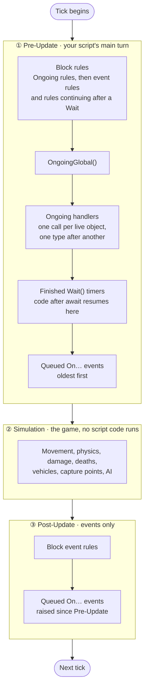
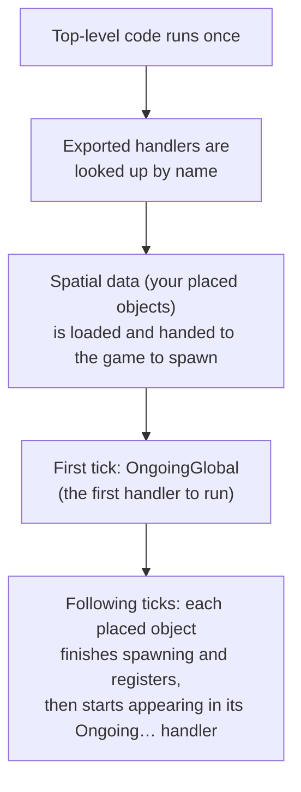
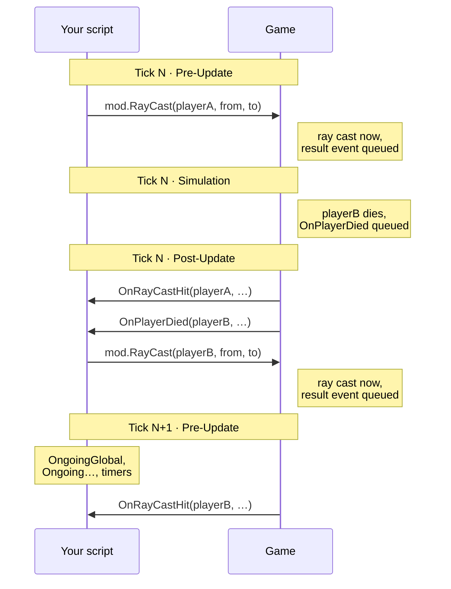

# Event Loop & Timing

This page explains **when** your Portal script runs: the order handlers are called in each server tick, when events
arrive, how `await mod.Wait()` behaves, and how `RayCast` results come back. It applies to both TypeScript and block
code.

## The short version

- The server runs in **ticks**, normally **30 per second**. Experiences granted 60 Hz by the game's developers run at
  60 per second, as long as their scripts stay within the time budget.
- Your script gets **two turns per tick**: a **Pre-Update** before the game simulates the world, and a
  **Post-Update** after it.
- **Pre-Update** runs `OngoingGlobal`, then every `Ongoing…` handler, then finished `Wait` timers, then queued `On…`
  events.
- **Post-Update** runs only the `On…` events raised since Pre-Update.
- **Events never run in the middle of your code.** An action that causes an event (killing a player, seating them in
  a vehicle, casting a ray) queues the event, and your handler runs later.
- **Block code runs before TypeScript.** In an experience that uses both, the block rules take their turn first in
  each stage, then TypeScript. See [Block code and TypeScript together](#block-code-and-typescript-together).

## One tick, step by step



After every handler call (each `Ongoing…` call, each event, each timer), any promise continuations your code queued
run immediately, before the next handler. Experiences without block code skip the block steps; experiences without
TypeScript skip the rest.

## Script startup



- **Top-level code runs before anything else.** Use it for one-time setup that doesn't touch the map.
- **`OngoingGlobal` is the first handler to run after top-level code**, on the first tick. Nothing runs in between.
- **Handlers are found once, by exact name, right after top-level code finishes.** A misspelled handler
  (`OnPlayerDeploy` instead of `OnPlayerDeployed`) is never called, and there is no error.
- **Events you have no handler for cost nothing.** They aren't even queued.
- `OnPlayerJoinGame` can fire **before** `OnGameModeStarted`.

### When placed objects are ready

The objects you place in the map editor (capture points, HQs, spawners, area triggers, world icons, …) are not
loaded until **after** your top-level code has run, and they then take several ticks to spawn. Each object becomes
usable by your script the moment it finishes spawning and registers itself. From then on:

- it gets its first `Ongoing…` call, and is included in that handler every tick after;
- `mod.GetCapturePoint(id)` (and the other `Get…(id)` functions) return the live object.

Before that, a `Get…(id)` call still gives you a handle (a handle is just the id), but it doesn't point at a spawned
object yet, and reads like position come back as `(0,0,0)`. How long spawning takes depends on the map and on how
much you placed. Don't use position as a readiness test: spawners, vehicle spawners and interact points report
`(0,0,0)` from `GetObjectPosition` even once they're ready. The first `Ongoing…` call is the reliable signal.

So don't use placed objects in top-level code. Set them up when their first `Ongoing…` call arrives, or wait for it:

```ts
const readyCapturePoints = new Set<number>();

export function OngoingCapturePoint(cp: mod.CapturePoint) {
    const id = mod.GetObjId(cp);
    if (!readyCapturePoints.has(id)) {
        readyCapturePoints.add(id);
        setupCapturePoint(cp); // first call: this capture point is spawned and ready
    }
}
```

## Ongoing handler order

Every tick, `OngoingGlobal` runs first. Then each `Ongoing…` handler you export runs **once for every live object of
that type**, in this order:

| # | Handler | # | Handler |
|---|---|---|---|
| 1 | `OngoingGlobal` | 11 | `OngoingSector` |
| 2 | `OngoingPlayer` | 12 | `OngoingLootSpawner` |
| 3 | `OngoingTeam` | 13 | `OngoingRingOfFire` |
| 4 | `OngoingCapturePoint` | 14 | `OngoingSpawnPoint` |
| 5 | `OngoingVehicle` | 15 | `OngoingMCOM` |
| 6 | `OngoingAreaTrigger` | 16 | `OngoingWorldIcon` |
| 7 | `OngoingWaypointPath` | 17 | `OngoingVehicleSpawner` |
| 8 | `OngoingInteractPoint` | 18 | `OngoingEmplacementSpawner` |
| 9 | `OngoingSpawner` | 19 | `OngoingBomb` |
| 10 | `OngoingHQ` | 20 | `OngoingBlockingSphere` |

- **Each type finishes before the next starts.** Every `OngoingPlayer` call happens before the first `OngoingTeam`
  call.
- **Objects within a type come in no particular order.** It isn't by object ID, and it changes as objects come and
  go. If you need a stable order, collect the objects and sort them yourself.
- **New objects show up in `Ongoing…` before their spawn events.** A newly spawned AI soldier appears in
  `OngoingPlayer` a tick before `OnSpawnerSpawned`, `OnPlayerDeployed` and `OnPlayerJoinGame` fire for it.

## How events are delivered

Every `On…` event goes through a queue, and each stage delivers **one batch** from it:

1. Something happens in the game, or your script calls an action that causes it.
2. The event and its arguments are **queued**.
3. At the **start** of each Pre-Update and Post-Update, the engine takes everything queued so far as that stage's
   batch, and delivers it **in the order the events happened**.
4. Anything raised **while a stage is running** (by your handlers, by actions they call, or by the game) waits in
   the queue for the **next** stage's batch, never the current one.

What this means in practice:

- **Events never cascade within a stage.** If `OnPlayerDied` calls an action that raises another event, that event
  runs in the next stage at the earliest, after every other event already in this stage's batch.
- **Chains move one stage at a time.** An action in Pre-Update produces its event in Post-Update; an action taken in
  that Post-Update handler produces its event in the next tick's Pre-Update, and so on.
- **A batch runs in the order it was raised.** Within a stage, handlers run strictly in the order the events were
  raised, whatever their type.
- **Promise continuations are the exception.** Code after an `await` on something your handler just resolved runs
  immediately after that handler, in the same stage; it isn't queued like an event.

Which stage an event lands in depends on **when it was raised**:

| Raised during… | Delivered in… |
|---|---|
| Your Pre-Update code (e.g. an action called from `OngoingGlobal`) | Post-Update of the **same** tick |
| The Simulation (deaths, capture-point entry, vehicle seats, …) | Post-Update of the **same** tick |
| Your Post-Update code | Pre-Update of the **next** tick, after the `Ongoing…` handlers and timers |
| Other game systems after Post-Update | Pre-Update of the **next** tick |

Common examples:

| Delivered in Pre-Update | Delivered in Post-Update |
|---|---|
| `OnSpawnerSpawned` | `OnPlayerDied` |
| `OnAIMoveToRunning`, `OnAIMoveToFailed` | `OnPlayerEnterCapturePoint` |
| `OnPlayerDamaged` | `OnPlayerEnterVehicleSeat` |
| `OnMandown` | `OnRayCastHit` / `OnRayCastMissed` for a ray cast in Pre-Update |

### What this means for your code

- **An action never calls your handler immediately.** After `mod.ForcePlayerToSeat(...)` returns, the player is
  seated, but `OnPlayerEnterVehicleSeat` runs later. Do the follow-up work in the handler, not on the next line.
- **Some actions take several ticks to produce their events.** `SpawnAIFromAISpawner` produces `OnSpawnerSpawned`,
  `OnPlayerDeployed` and `OnPlayerJoinGame` on later ticks.
- **The order of related events varies by cause.** `OnPlayerDamaged` and `OnMandown` can arrive **after**
  `OnPlayerDied` for AI deaths, so don't rely on a fixed damage → mandown → death sequence.
- **Arguments are captured when the event happens.** By the time your handler runs, the player may have left
  or died. Check `mod.IsPlayerValid(player)` before acting on a player from an event.
- **Numbers in event arguments are single-precision floats.** Decimals arrive slightly off: `0.1` comes through as
  `0.10000000149011612`. Don't compare them with `===`; round them, or compare within a small tolerance.

## Block code and TypeScript together

An experience can use block code and TypeScript at the same time. They run as two separate parts of the same
script, one after the other, in every stage:

| Stage | First | Then |
|---|---|---|
| Pre-Update | Block rules: Ongoing rules, then event rules and rules continuing after a `Wait` | TypeScript: `OngoingGlobal`, `Ongoing…` handlers, `Wait` timers, `On…` events |
| Post-Update | Block event rules | TypeScript `On…` events |

- **Both get the same events.** At the start of each stage, the batch of queued events goes to the block rules and
  to TypeScript. Block rules handle theirs first.
- **Neither sees what the other raises in the same stage.** An event caused by a block action waits for the next
  stage's batch, where both get it, just like an event caused by TypeScript.
- **Block code can't see TypeScript's changes from the same stage.** Anything TypeScript does in a stage happens
  after the block rules for that stage have run, so block rules see it the next time they run.
- **Block `Wait`s finish in Pre-Update**, like `mod.Wait()` in TypeScript. A block rule that is waiting never
  continues during Post-Update.
- **Chase Variable blocks update first.** Variables being chased (`ChaseVariableAtRate`, `ChaseVariableOverTime`)
  advance at the very start of Pre-Update, before any block rule or TypeScript handler reads them.

### Calling TypeScript from blocks

Two blocks call a function exported from your TypeScript:

| Block | Use |
|---|---|
| `JsAction(name, arg0, arg1)` | Call a function as an action. Its return value is ignored |
| `JsValue(name, arg0, arg1)` | Call a function and use what it returns as a value |

```ts
// JsAction("main.Announce", "Round over", 5)
export function Announce(text: string, seconds: number) {
    console.log(`${text} (${seconds}s)`);
}

// JsValue("main.TicketsFor", 1, 0): the second argument is unused, but the block always passes two
export function TicketsFor(teamId: number, _unused: unknown): number {
    return mod.GetGameModeScore(mod.GetTeam(teamId));
}
```

- **Name the function `main.` plus its export name**, like `main.Announce`. The function must be exported. `main`
  is not case-sensitive. Any other prefix calls a function from `modlib` instead (`modlib.ParseUI`).
- **The call runs immediately**, in the middle of the block rule, before the block's next action. So TypeScript code
  called this way runs during the block part of the stage, before TypeScript's own handlers for that stage.
- **Every call passes exactly two arguments.** Give the function two parameters, even if it only uses one.
- **`JsValue` can return a number, a boolean, a string, or any `mod` value** (a player, a vector, a `mod` array, …).
  Numbers come back as single-precision floats. Anything else (`undefined`, `null`, a plain object, a JavaScript
  array) gives the block an empty value.
- **Return lists as `mod` arrays.** Build them with `mod.EmptyArray()` and `mod.AppendToArray()`; a JavaScript array
  doesn't convert.

```ts
// JsValue("main.MissionList", 0, 0) returns a list block code can loop over
export function MissionList(_a: unknown, _b: unknown) {
    let list = mod.EmptyArray();
    for (const name of ["Attack A", "Defend B", "Capture C"]) {
        list = mod.AppendToArray(list, name);
    }
    return list;
}
```

- **Errors don't stop the block rule.** If the function throws, the error is written to the Portal log with its
  stack trace, the block rule carries on, and `JsValue` gives an empty value.
- **Don't call `async` functions from blocks.** The function runs until its first `await`, and the block moves on.
  The rest never runs inside the block: it continues later, after TypeScript's next handler call. A `JsValue` on an
  `async` function gets a promise, which can't be converted, so the block gets an empty value.
- **TypeScript can't call block rules.** There is no TypeScript function that runs a block rule or subroutine. To
  signal block code, change something a block rule checks: a variable, or the game state.

## Wait and async code

`mod.Wait(seconds)` returns a promise. Use it with `await`:

```ts
async function countdown(): Promise<void> {
    for (let i = 3; i > 0; i--) {
        // show i to players...
        await mod.Wait(1);
    }
}
```

### Timers vs. promises

An `await` resumes when its promise resolves. The code after it runs right after the handler that resolved the
promise finishes, before the next handler.

- **`mod.Wait()` is a timer.** The engine resolves it in the timer step of Pre-Update once its time is up, never
  during Post-Update. It is the built-in way to wait for time.
- **A promise you resolve yourself continues wherever you resolve it.** Resolve it from an event or `Ongoing…`
  handler on a later tick and the awaiting code continues on that tick, in that handler's stage. This is how you wait
  for game state instead of time.
- **An already-resolved promise doesn't delay anything.** Awaiting an async helper that never waits continues right
  after the current handler, in the same tick.

```ts
const deployWaiters = new Map<number, () => void>();

function waitForDeploy(player: mod.Player): Promise<void> {
    return new Promise((resolve) => deployWaiters.set(mod.GetObjId(player), resolve));
}

export function OnPlayerDeployed(player: mod.Player) {
    const id = mod.GetObjId(player);
    deployWaiters.get(id)?.(); // anything awaiting waitForDeploy(player) continues right after this handler
    deployWaiters.delete(id);
}

async function respawnFlow(player: mod.Player): Promise<void> {
    await waitForDeploy(player); // may take many ticks
    await mod.Wait(0.5);         // then a timer: continues in a later Pre-Update
    // ...
}
```

### How Wait behaves

- **Timers are checked once per tick, in Pre-Update**, after the `Ongoing…` handlers and before queued events. A wait
  can't finish between ticks, so its resolution is one tick (about 33 ms at 30 Hz, 17 ms at 60 Hz).
- **`await mod.Wait(0)` means "continue next tick".** Your code resumes in the next tick's Pre-Update, after that
  tick's `Ongoing…` handlers.
- **A `Wait` started while timers are being processed always waits until at least the next tick,** even `Wait(0)`.
- **An `async` function runs normally until its first `await`.** Calling `void doThing()` runs `doThing` up to its
  first `await` right away, then returns.
- **Waits that finish on the same tick have no guaranteed order.** The most recently started one usually resumes
  first. If two waits must run in order, chain them in one async function.
- **Code after `await` runs as soon as its timer fires**, before the next timer is processed, so heavy work after a
  wait adds to that tick's cost.
- **`modlib.WaitUntil(delay, cond)` checks its condition every 0.2 seconds** (every 6 ticks at 30 Hz), so it can react
  up to 0.2 s late. For per-tick checks, loop on `await mod.Wait(0)` or use an `Ongoing…` handler.

## Sync vs. async handlers

The engine calls your handler and ignores whatever it returns. An `async` handler returns a promise, and the engine
drops it without waiting for it. As far as the engine is concerned, the handler is finished at its first `await` that
doesn't resolve immediately. Everything after that runs later, when that promise resolves, mixed in with other
handlers and later ticks.

- **Default to plain (sync) handlers.** Only make a handler `async` if it actually waits. An `async` handler with no
  `await` behaves the same as a sync one, but creates a promise on every call for nothing.
- **Never make an `Ongoing…` handler async and wait inside it.** It is called every tick for every object, so each
  waiting call leaves another copy suspended. The copies overlap, memory keeps growing, and the server eventually
  stops the script. For timed work, start one async loop from `OnGameModeStarted` instead.
- **Code after an `await` runs in a later tick or stage than the handler started in.** Other events, including ones
  for the same player, may have run in between, so re-check your state before acting on it.
- **Re-check players after every `await`.** A `mod.Player` handle is just the player's id number. When a player
  leaves, a player who joins later can be given the same id, and then the old handle (or a stored id) points at the
  new player, and `mod.IsPlayerValid` returns `true` for it. Neither a handle nor an id can tell you it's still the
  same person, so track each player's lifetime with `OnPlayerJoinGame` / `OnPlayerLeaveGame` and check it after
  every `await`, as in the example below.
- **Errors are logged either way.** A throw in a sync handler, or an uncaught error in an async one, is written to
  the Portal log with its stack trace, and the script keeps running.

The pattern that works well: keep the handler sync, hand anything that needs to wait to its own async function, and
give each player a session token that is replaced when they leave, so waiting code can tell whether it is still
dealing with the same person.

```ts
const sessions = new Map<number, object>(); // player id -> token for whoever holds that id now

export function OnPlayerJoinGame(player: mod.Player) {
    sessions.set(mod.GetObjId(player), {});
}

export function OnPlayerLeaveGame(playerId: number) {
    sessions.delete(playerId);
}

export function OnPlayerDeployed(player: mod.Player) {
    setupPlayer(player);        // runs now, in order with other events
    void introSequence(player); // the waiting part runs on its own
}

async function introSequence(player: mod.Player): Promise<void> {
    const id = mod.GetObjId(player);
    const session = sessions.get(id);
    await mod.Wait(3);
    if (sessions.get(id) !== session || !mod.IsPlayerValid(player)) return; // left, or someone else has the id now
    // ...
}
```

## RayCast

`mod.RayCast` doesn't return a result. The ray is cast immediately, and the answer arrives later as an
`OnRayCastHit` or `OnRayCastMissed` event.



- **One raycast per player per tick** with `RayCast(player, from, to)`, plus **one global raycast per tick** with
  `RayCast(from, to)`. The two kinds don't block each other, and every player has their own slot.
- **The first cast in a tick wins.** Any further cast into the same slot that tick is **silently dropped**: no hit
  event, no miss event, no error.
- **A slot's limit covers the whole tick, both stages.** Pre-Update and Post-Update count as the same tick, so if you
  cast in Pre-Update and then cast into the **same** slot again from `OnRayCastHit` in Post-Update, the second cast
  is dropped. A follow-up cast into a **different** slot (another player, or the global overload) works, and its
  result arrives next tick.
- **Results arrive in the order the rays were cast.**
- **A ray cast in Pre-Update gets its result in Post-Update of the same tick.** A ray cast in Post-Update (for
  example from `OnRayCastHit` or `OnPlayerDied`) gets its result in the next tick's Pre-Update.

Chaining rays from their own results, for one player:

| Tick | Stage | What happens |
|---|---|---|
| N | Pre-Update | `OngoingGlobal` casts ray A for player X |
| N | Post-Update | `OnRayCastHit(A)` runs. Casting for player X again here is **dropped** (same slot, same tick). Cast into another slot, or wait a tick |
| N+1 | Pre-Update | player X's slot is free again: cast ray B |
| N+1 | Post-Update | `OnRayCastHit(B)` runs |

So one player can get at most one ray result per tick, however you chain them.
- **The global overload reports an invalid player** in `OnRayCastHit` / `OnRayCastMissed` (`GetObjId` returns `-1`).
- **Dead, undeployed or invalid players get no result.**

::: tip Casting several rays for one player
Spread them across ticks:

```ts
for (const target of targets) {
    mod.RayCast(player, eyePos, target);
    await mod.Wait(0); // next cast goes into next tick's slot
}
```

The events carry no request ID. Keep your own queue of what you cast, in order, and match each result to the oldest
pending cast for that player.
:::

## Performance

- **`Ongoing…` handlers are the most expensive place to put code.** At 30 ticks per second, `OngoingPlayer` with 64
  players runs about **1,900 times per second** (3,800 at 60 Hz). Keep it small, and move rarely-changing work to
  events or timers.
- **Unused handlers are free.** Don't export empty `Ongoing…` handlers "just in case".
- **The server stops scripts that go over their time or memory budget,** and they stay disabled for the rest of the
  match.
  - Keep per-tick work light, and spread heavy work across ticks with `await mod.Wait(0)`.
  - Don't let data grow without bound (ever-growing arrays, maps or logs). Memory use is checked every tick.
- See [Optimization](/optimization) for general guidance.

## Quick reference

| Question | Answer |
|---|---|
| How often does `OngoingGlobal` run? | Once per tick: 30 times per second, or 60 for experiences granted 60 Hz |
| What runs first each tick? | `OngoingGlobal`, then the other `Ongoing…` handlers in the table order |
| Does calling an action run its event handler immediately? | No. Events are always queued |
| When does code after `await mod.Wait(0)` run? | Next tick, in Pre-Update, after the `Ongoing…` handlers |
| Does any other `await` delay my code? | Only until its promise resolves. An already-resolved one continues in the same tick; one you resolve from a later handler continues there |
| Should my event handlers be `async`? | Only if they wait. Keep them sync by default, and never wait inside an `Ongoing…` handler |
| Can I rely on the order of players in `OngoingPlayer`? | No |
| Can I cast two rays for one player in one tick? | No. Only the first counts; the rest are dropped |
| Is an event's player still valid when my handler runs? | Not guaranteed. Check `mod.IsPlayerValid` |
| Do block rules or TypeScript handlers run first? | Block rules, in both stages |
| When does a function called with `JsAction` / `JsValue` run? | Immediately, inside the block rule |
| Can TypeScript call a block rule? | No. Signal it through a variable or game state it checks |

## Related pages

- [Scripting](/scripting)
- [TypeScript](/typescript)
- [Block Code](/block-code)
- [Optimization](/optimization)
- [TypeScript API Reference](/typescript-api-reference)
