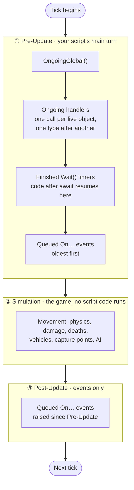
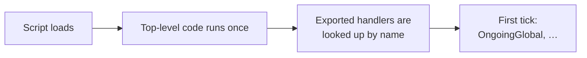
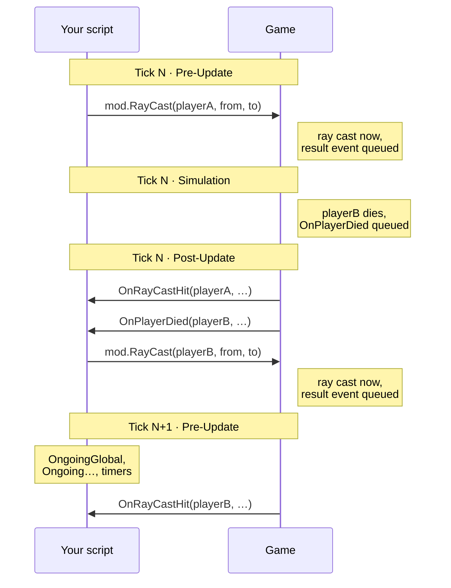

# Event Loop & Timing

This page explains **when** your Portal script runs: the order handlers are called in each server tick, when events
arrive, how `await mod.Wait()` behaves, and how `RayCast` results come back.

It applies to both TypeScript and block code. Both run on the same event loop.

::: info How we know this
Everything here comes from two sources that agree with each other: analysis of the game's own code and data (update
1.4.3.0), and in-game test scripts that log what actually happens. Points marked **Confirmed in game** were observed
directly. Points marked **From engine analysis** were read from the game but not separately tested.
:::

## The short version

- The server runs in **ticks**: normally **30 per second**. An experience can run at 60 per second only if the game's
  developers have granted it 60 Hz, and only while its scripts are fast enough to stay within the time budget.
- Your script gets **two turns per tick**: a **Pre-Update** before the game simulates the world, and a
  **Post-Update** after it.
- **Pre-Update** runs `OngoingGlobal`, then every `Ongoing…` handler, then finished `Wait` timers, then queued `On…`
  events.
- **Post-Update** runs only queued `On…` events: the ones raised since Pre-Update.
- **Events never run in the middle of your code.** Calling an action that causes an event (killing a player,
  seating them in a vehicle, casting a ray) queues the event. Your handler runs later.

## One tick, step by step



After **every single handler call** (each `Ongoing…` call, each event, each timer), any promise continuations your
code queued run immediately, before the next handler. So code after an `await` on something that is already
resolved runs right away, not on a later tick.

::: tip Engine names
Internally these are Frostbite's `PreSim` and `PostSim` update passes. The script entity registers for both, every
tick. **From engine analysis.**
:::

## Script startup



- **Top-level code runs before any handler.** It is the place for one-time setup. **Confirmed in game.**
- **Handlers are found once, by exact name, right after top-level code finishes.** A misspelled handler
  (`OnPlayerDeploy` instead of `OnPlayerDeployed`) is never called, and there is no error. **From engine analysis.**
- **Events you have no handler for cost nothing.** The engine does not even queue them. **From engine analysis.**
- Map objects can exist at load time but not be ready yet. Capture point and HQ positions read `(0,0,0)` during
  top-level code and become real just before their `Ongoing…` handlers start running. Treat the first `Ongoing…` call
  for a type as its "ready" signal. **Confirmed in game.**
- `OnPlayerJoinGame` can fire **before** `OnGameModeStarted`. **Confirmed in game.**

## Ongoing handler order

Every tick, `OngoingGlobal` runs first. Then each `Ongoing…` handler you export runs **once for every live object of
that type**, and the types always run in this order:

| # | Handler | # | Handler |
|---|---|---|---|
| 1 | `OngoingGlobal` | 11 | `OngoingSector` |
| 2 | `OngoingPlayer` | 12 | `OngoingLootSpawner` |
| 3 | `OngoingTeam` | 13 | `OngoingRingOfFire` |
| 4 | `OngoingCapturePoint` | 14 | `OngoingSpawnPoint` |
| 5 | `OngoingVehicle` | 15 | `OngoingMCOM` |
| 6 | `OngoingAreaTrigger` | 16 | `OngoingWorldIcon` |
| 7 | `OngoingWaypointPath` | 17 | `OngoingVehicleSpawner` |
| 8 | `OngoingInteractPoint` | 18 | `OngoingEmplacementSpawner` |
| 9 | `OngoingSpawner` | 19 | `OngoingBomb` |
| 10 | `OngoingHQ` | 20 | `OngoingBlockingSphere` |

Positions 1–18 are **Confirmed in game**. `OngoingBomb` and `OngoingBlockingSphere` (added with BlockingSphere in
update 1.4.3.0) are placed by **engine analysis**. The order comes from the game's object registry, not from the
alphabetical order in the SDK's type file.

- **All of a type runs before the next type starts.** Every `OngoingPlayer` call finishes before the first
  `OngoingTeam` call.
- **The order of objects within a type is not reliable.** It is not by object ID and can change as objects come and
  go. If you need a stable order, collect the objects and sort them yourself.
- **New objects can show up in `Ongoing…` before their spawn events.** A newly spawned AI soldier appeared in
  `OngoingPlayer` a tick before `OnSpawnerSpawned`, `OnPlayerDeployed` and `OnPlayerJoinGame` fired for it.
  **Confirmed in game.**

## How events are delivered

Every `On…` event goes through a queue:

1. Something happens in the game (or your script calls an action that causes it).
2. The event and its arguments are **queued**.
3. At the start of the next Pre-Update or Post-Update, whichever comes first, the queue is handed to your script and
   the handlers run **in the order the events happened**.

Which stage an event lands in depends on **when the game raised it**:

| Raised during… | Delivered in… |
|---|---|
| Your Pre-Update code (e.g. an action you called from `OngoingGlobal`) | Post-Update of the **same** tick |
| The Simulation (deaths, capture-point entry, vehicle seats, …) | Post-Update of the **same** tick |
| Your Post-Update code | Pre-Update of the **next** tick, after the `Ongoing…` handlers and timers |
| Other game systems after Post-Update | Pre-Update of the **next** tick |

In our tests the following landed in each stage (**Confirmed in game**):

| Usually delivered in Pre-Update | Usually delivered in Post-Update |
|---|---|
| `OnSpawnerSpawned` | `OnPlayerDied` |
| `OnAIMoveToRunning`, `OnAIMoveToFailed` | `OnPlayerEnterCapturePoint` |
| `OnPlayerDamaged` | `OnPlayerEnterVehicleSeat` |
| `OnMandown` | `OnRayCastHit` / `OnRayCastMissed` for a ray cast in Pre-Update |

### What this means for your code

- **An action never calls your handler immediately.** After `mod.ForcePlayerToSeat(...)` returns, the player is
  seated, but `OnPlayerEnterVehicleSeat` runs later. Do the follow-up work in the handler, not on the next line.
- **Some actions take several ticks to produce their events.** `SpawnAIFromAISpawner` produced `OnSpawnerSpawned`,
  `OnPlayerDeployed` and `OnPlayerJoinGame` on later ticks, not the same one. **Confirmed in game.**
- **Event order between different events can vary by cause.** For example `OnPlayerDamaged` and `OnMandown` can
  arrive **after** `OnPlayerDied` for AI deaths. Do not assume a fixed damage → mandown → death sequence.
  **Confirmed in game.**
- **Arguments are a snapshot from when the event happened.** By the time your handler runs, the player may have left
  or died. Check `mod.IsPlayerValid(player)` before acting on a player from an event.
- **Numbers in event arguments are single-precision.** Whole numbers are exact up to 16,777,216. **From engine
  analysis.**

## Wait and async code

`mod.Wait(seconds)` returns a promise. Use it with `await`:

```ts
async function countdown(): Promise<void> {
    for (let i = 3; i > 0; i--) {
        // show i to players...
        await mod.Wait(1);
    }
}
```

How it behaves:

- **Timers are checked once per tick, in Pre-Update**, after the `Ongoing…` handlers and before queued events. A wait
  can't finish between ticks, so its real resolution is one tick (about 33 ms at 30 Hz, 17 ms at 60 Hz).
- **`await mod.Wait(0)` means "continue next tick".** Your code resumes in the next tick's Pre-Update, after that tick's
  `Ongoing…` handlers. **Confirmed in game.**
- **A `Wait` started while timers are being processed always waits at least until the next tick,** even
  `Wait(0)`. **Confirmed in game.**
- **An `async` function runs normally until its first `await`.** Calling `void doThing()` executes `doThing` up to its
  first `await` right there, then returns. **Confirmed in game.**
- **When several waits finish on the same tick, their order is not guaranteed.** In practice the most recently
  started one tends to resume first, but this changes as timers are added and removed. If two waits must run in
  order, chain them in one async function. **Confirmed in game / engine analysis.**
- **Code after `await` runs right after the timer fires**, before the next timer is processed. So a long chain of
  `await`-free work after a wait adds to that tick's cost.
- **`modlib.WaitUntil(delay, cond)` checks its condition every 0.2 seconds** (every 6 ticks at 30 Hz), so it can react
  up to 0.2 s late. For per-tick checks, loop on `await mod.Wait(0)` or use an `Ongoing…` handler.

## RayCast

`mod.RayCast` does not return a result. The ray is cast immediately, and the answer arrives later as an
`OnRayCastHit` or `OnRayCastMissed` event.



The rules (**Confirmed in game** on 1.4.3.0):

- **One raycast per player per tick** with `RayCast(player, from, to)`, plus **one global raycast per tick** with
  `RayCast(from, to)`. The two kinds don't block each other, and every player has their own slot (tested with 41
  players at once).
- **The first cast in a tick wins.** Any further cast into the same slot that tick is **silently dropped**: no hit
  event, no miss event, no error.
- **Results arrive in the order the rays were cast.**
- **A ray cast in Pre-Update gets its result in Post-Update of the same tick.** A ray cast in Post-Update (for
  example from `OnRayCastHit` or `OnPlayerDied`) gets its result in the next tick's Pre-Update.
- **The global overload reports an invalid player** in `OnRayCastHit` / `OnRayCastMissed` (`GetObjId` returns `-1`).
- **Dead, undeployed or invalid players get no result at all.**

::: tip Casting several rays for one player
Spread them across ticks:

```ts
for (const target of targets) {
    mod.RayCast(player, eyePos, target);
    await mod.Wait(0); // next cast goes into next tick's slot
}
```

The events carry no request ID. Keep your own queue of what you cast, in order, and match each result to the oldest
pending cast for that player.
:::

## Performance

- **`Ongoing…` handlers are the most expensive place to put code.** At 30 ticks per second, `OngoingPlayer`
  with 64 players runs roughly **1,900 times per second** (3,800 at 60 Hz). Keep it small, and move rarely-changing work to events or
  timers.
- **Unused handlers are free.** Don't export empty `Ongoing…` handlers "just in case".
- **The server can stop scripts that go over its budgets.** The engine has watchdogs for script **time** and for
  script **memory growth**. Their limits are configured on the server, not in the game files, so we can't tell you
  the exact numbers. A script that goes over one is **disabled for the rest of the match**. **From engine
  analysis.**
  - Keep per-tick work light, and spread heavy work across ticks with `await mod.Wait(0)`.
  - Don't let data grow without bound (ever-growing arrays, maps or logs). The memory check measures how much the
    script's memory has grown since it started, and runs at the end of every script tick.
- See [Optimization](/optimization) for general guidance.

## Quick reference

| Question | Answer |
|---|---|
| How often does `OngoingGlobal` run? | Once per tick: normally 30 times per second, 60 for experiences granted 60 Hz |
| What runs first each tick? | `OngoingGlobal`, then the other `Ongoing…` handlers in the table order |
| Does calling an action run its event handler immediately? | No. Events are always queued |
| When does code after `await mod.Wait(0)` run? | Next tick, in Pre-Update, after the `Ongoing…` handlers |
| Can I rely on the order of players in `OngoingPlayer`? | No |
| Can I cast two rays for one player in one tick? | No. Only the first counts; the rest are dropped |
| Is an event's player still valid when my handler runs? | Not guaranteed. Check `mod.IsPlayerValid` |

## Related pages

- [Scripting](/scripting)
- [TypeScript](/typescript)
- [Block Code](/block-code)
- [Optimization](/optimization)
- [TypeScript API Reference](/typescript-api-reference)
